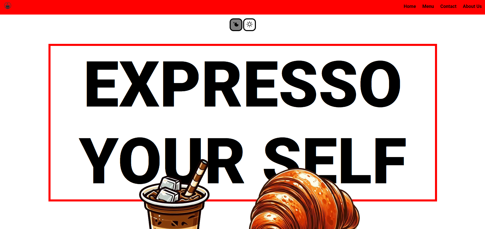
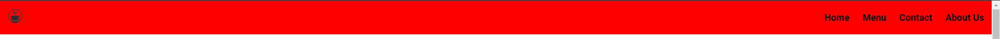
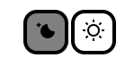
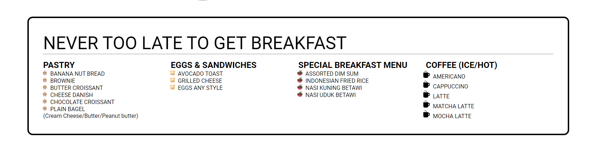
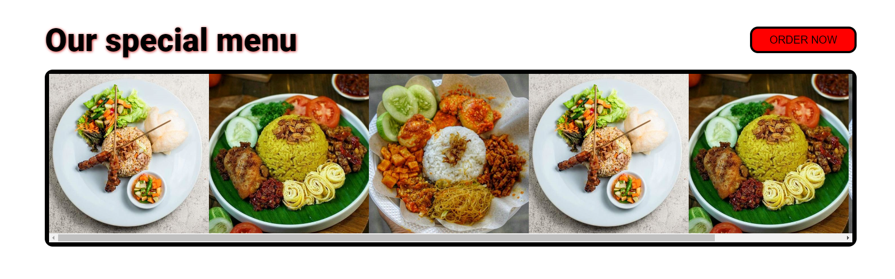
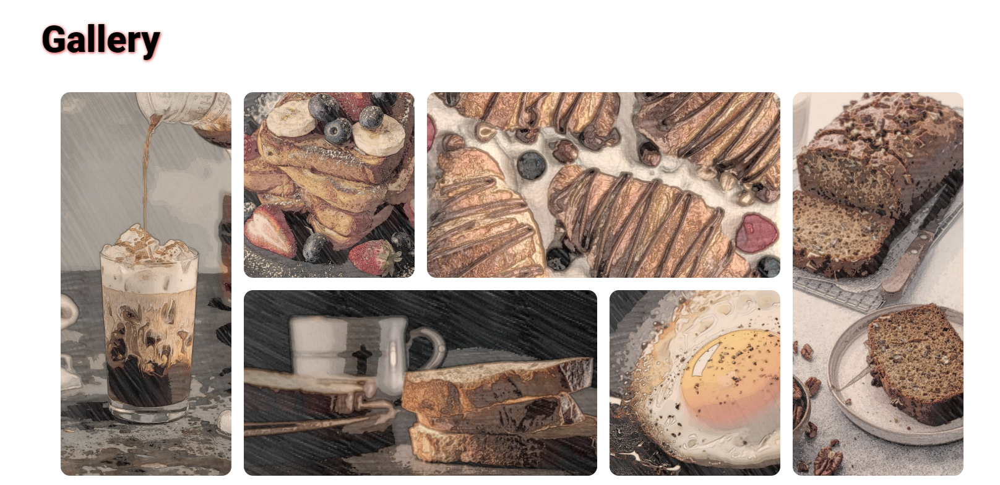
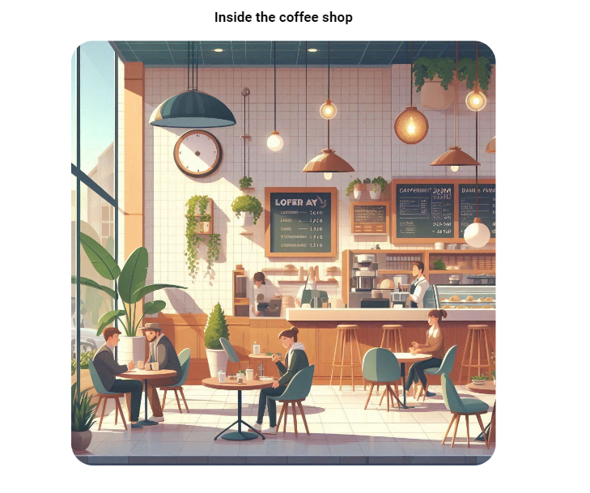
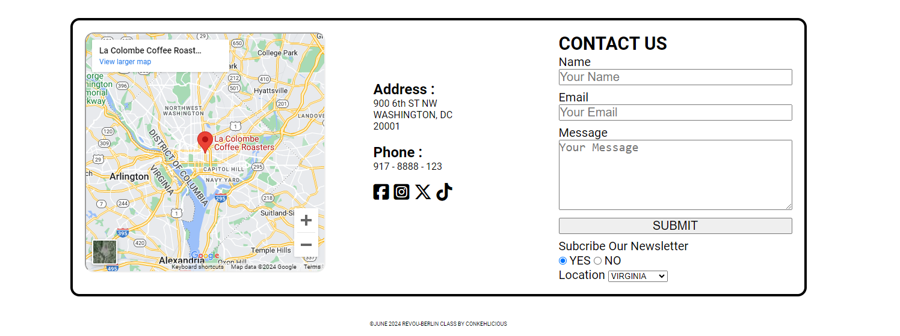

# Small Coffeshop business Landing page practice (HTML CSS)

## features :

##### • Position fixed Navbar

##### • Dark and Light mode buttons

##### • Foods and Beverages Menu (list-style-image added)

##### • Special Menu (images scroll added) with "ORDER BUTTON"

##### • Gallery (images transition added) asymmetric grid

##### • Cafe Interior (Image media responsive added)

##### • About us or Contact us with "Submit Form"

##### • I'm Working on my simple landing page project using

 

###### • Hit me up : conkehlicious@gmail.com

# About This Project

##### • Small Business landing page with form

# Take a peep at This Project

##### https://coffee0808.netlify.app

##### https://thongthong.my.id

##### https://revou-fsse-5.github.io/module-2-conkehlicious/
