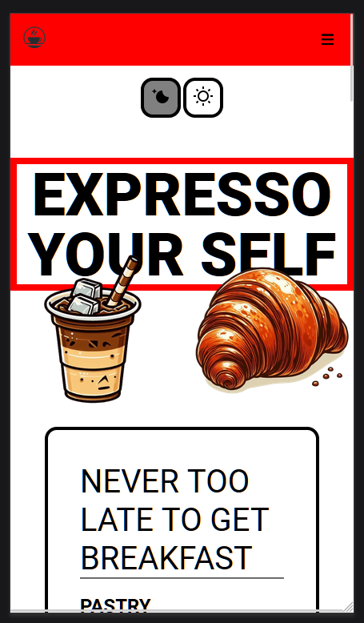
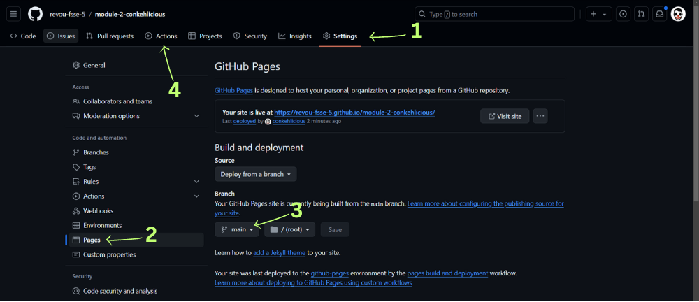

<h1 align="center"> 

<h2 align="center"> Small Coffeshop business Landing page practice with</h2>

  

## Features :

##### • Position fixed Navbar

##### • Dark and Light mode buttons created with Javascript

##### • Foods and Beverages Menu (list-style-image added)

##### • Special Menu (images scroll added) with "ORDER BUTTON"

##### • Gallery (images transition added) asymmetric grid

##### • Cafe Interior (Image media responsive added)

##### • About us or Contact us with "Submit Form" and Google Map 

##### •  media responsive for mobile

<h2>Github Deployment</h2>

##### 1. Go to setting
##### 2. Pages
##### 3. Choose Main and save it
##### 4. Click Action and done

<h2>Deploy From Github to Netlify</h2>

##### 1. Sign up or Login to Netlify 
##### 2. Add new site --> import an existing project (github)
##### 3. Pick your project, type site name and hit deploy

<h2>Get Your Own Domain</h2>

##### 1. Sign up or Login to https://www.niagahoster.co.id/
##### 2. Search domain that suits your need
##### 3. Make a payment and you are done!!!

<h2>Add Your Own Domain to Netlify </h2>

### • Hit me up : conkehlicious@gmail.com

# Take a peep at This Project

##### https://coffee0808.netlify.app

##### https://thongthong.my.id

##### https://revou-fsse-5.github.io/module-2-conkehlicious/
